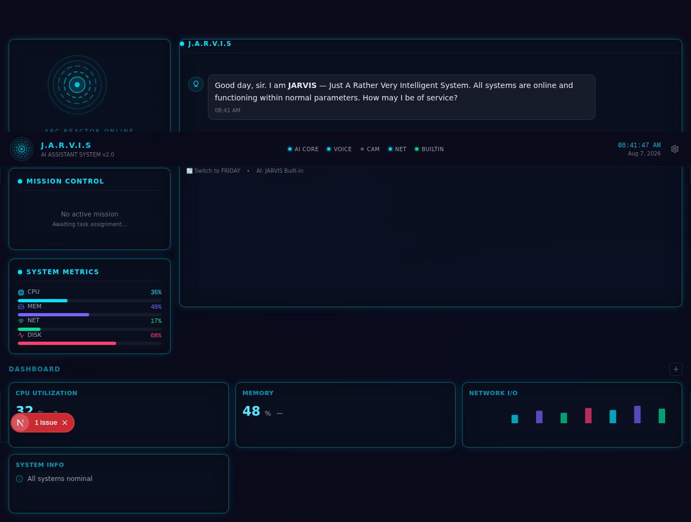

# JARVIS / F.R.I.D.A.Y — AI Assistant System

> An AI assistant inspired by Iron Man's JARVIS and F.R.I.D.A.Y, built with Next.js 16, TypeScript, and a holographic HUD interface. **100% free — no paid APIs required.**



---

## ✨ Features

### 🧠 AI Intelligence
- **Built-in AI** — Smart rule-based system that works instantly with NO API keys
- **HuggingFace** — Free tier LLM (bring your free HF token)
- **Ollama** — Run LLMs locally on your machine (completely free)
- **Dual personality** — Switch between JARVIS (formal, British) and F.R.I.D.A.Y (casual, efficient)

### 🗣️ Voice Interface
- **Speech-to-Text** — Talk to Jarvis using your browser's microphone (Web Speech API, FREE)
- **Text-to-Speech** — Jarvis talks back with natural voice (Web Speech API, FREE)
- **Auto-speak mode** — Automatically reads responses aloud
- **Waveform visualization** — Visual feedback when listening/speaking

### ✋ Hand Tracking
- **MediaPipe Hands** — Control the interface with your hand via webcam (FREE)
- **Virtual Cursor** — Index finger controls the cursor position
- **Pinch to Click** — Thumb + index pinch triggers mouse clicks
- **Camera toggle** — Start/stop camera from the status bar

### 🌐 Web Capabilities
- **Web Search** — Search the internet via DuckDuckGo (FREE, no API key)
- **URL Reader** — Read and summarize any web page (FREE)
- **Smart routing** — Just say "search for X" or "read https://..." and Jarvis handles it

### 📊 Dashboard
- **Draggable widgets** — Add/remove stat, chart, and info widgets
- **System metrics** — Live CPU, memory, network, disk monitoring
- **Mission tracker** — Step-by-step task progress

### 🎨 HUD Interface
- **Arc Reactor** — Animated SVG with concentric rotating rings
- **Holographic panels** — Semi-transparent glowing panels with scan-line effects
- **Dark theme** — Deep space black with cyan/purple accents
- **Responsive** — Works on mobile, tablet, and desktop

---

## 🚀 Quick Start

```bash
# Install dependencies
npm install

# Run development server
npm run dev
```

Open [http://localhost:3000](http://localhost:3000) and start talking to JARVIS!

**No configuration needed** — the built-in AI works immediately.

---

## 💬 Commands

| Command | Example | Description |
|---------|---------|-------------|
| Chat | "Hello" | Natural conversation |
| Search | "search for quantum computing" | Web search via DuckDuckGo |
| Read | "read https://example.com" | Extract content from any URL |
| Calculate | "calculate 25 * 37" | Math calculations |
| Time | "what time is it?" | Current time and date |
| Status | "system status" | System diagnostics |
| Help | "what can you do?" | List all capabilities |
| Add Widget | "add chart widget" | Add dashboard widget |
| Remove Widget | "remove widget" | Remove last widget |
| Switch AI | Click "Switch to FRIDAY" | Toggle JARVIS/FRIDAY personality |

---

## 🔧 Configuration

### AI Providers

Switch AI providers via the **⚙ Settings** button in the status bar:

| Provider | Cost | Setup |
|----------|------|-------|
| **Built-in** | FREE | No setup needed — works immediately |
| **HuggingFace** | FREE (tier) | Get free token at [huggingface.co](https://huggingface.co/settings/tokens) |
| **Ollama** | FREE | Install [Ollama](https://ollama.ai) and run a model locally |

### Environment Variables (Optional)

```env
# For HuggingFace provider
HUGGINGFACE_TOKEN=hf_xxxxxxxxxxxx

# For Ollama provider
OLLAMA_ENDPOINT=http://localhost:11434
OLLAMA_MODEL=llama3.2
```

---

## 🏗️ Architecture

See [ARCHITECTURE.md](./ARCHITECTURE.md) for detailed system design.

Key design principles:
- **Free-first** — Every feature works without paid APIs
- **Modular AI** — Swap LLM providers without changing app code
- **Client-side voice** — Uses browser APIs, no server needed
- **Server-side tools** — Web search and URL reading handled by API routes
- **Zustand state** — Centralized state management for chat, missions, widgets

---

## 🛠️ Tech Stack

| Technology | Purpose |
|------------|---------|
| Next.js 16 | Full-stack React framework (App Router) |
| TypeScript | Type safety throughout |
| Tailwind CSS 4 | Utility-first styling |
| shadcn/ui | UI component library |
| Framer Motion | Animations and transitions |
| Zustand | State management |
| Recharts | Charts and data visualization |
| react-markdown | Render markdown in chat responses |
| Lucide React | Icons |

---

## 📁 Project Structure

See [FOLDER-MAP.txt](./FOLDER-MAP.txt) for the complete file tree.

---

## 🤝 Contributing

See [CONTRIBUTING.md](./CONTRIBUTING.md) for guidelines.

---

## 📄 License

MIT License — see [LICENSE.md](./LICENSE.md).

---

## 🎬 Credits

Inspired by **JARVIS** and **F.R.I.D.A.Y** from Marvel's Iron Man films.

Built as an open-source, free AI assistant that anyone can run and customize.

---

*"Just A Rather Very Intelligent System."*
